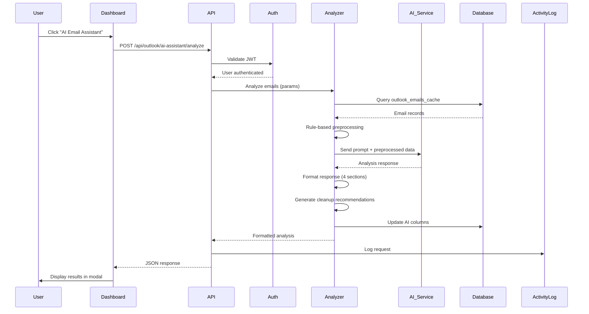

# Design Document: AI Email Intelligence Assistant

## Overview

The AI Email Intelligence Assistant is a JARVIS-style intelligent email analysis system that provides human-like decision-making and actionable insights from stored email data in the `outlook_emails_cache` PostgreSQL table. The system analyzes emails to detect urgency, sentiment, and intent, providing smart recommendations while maintaining system hygiene through automated cleanup suggestions.

The assistant operates with a confident, direct, and intelligent tone, producing complete, decision-driven responses without asking questions. It prioritizes recent emails (last 48 hours) and focuses on detecting urgency, unread duration, customer dissatisfaction, missed replies, high-value leads, and system inefficiencies.

### Key Design Principles

1. **Decision-Driven Output**: Never ask questions; always provide complete, actionable insights
2. **Deep Analysis**: Multi-factor scoring combining urgency, sentiment, intent, and temporal patterns
3. **System Hygiene**: Proactive data cleanup recommendations to optimize storage
4. **Strict Format Compliance**: Four-section output structure (Summary, Insights, Smart Actions, System Optimization)
5. **Resilience**: Graceful error handling with fallback responses
6. **Local-First AI**: Use Ollama for local, cost-free, privacy-first AI inference (no external API dependencies)
7. **Hybrid Processing**: Rule-based preprocessing + local AI generation for optimal performance

## Architecture

### System Components

```mermaid
graph TB
    subgraph "Frontend Layer"
        UI[Dashboard UI<br/>dashboard.html]
    end
    
    subgraph "Backend Layer"
        API[Express API<br/>outlook.js routes]
        Auth[JWT Middleware<br/>auth.js]
        ActivityLog[Activity Logger<br/>activityLog.js]
    end
    
    subgraph "Analysis Engine"
        Analyzer[Email Analyzer]
        Formatter[Response Formatter]
        Cleanup[Cleanup Manager]
    end
    
    subgraph "External Services"
        AI[Local AI Service<br/>Ollama (llama3:3b)]
    end
    
    subgraph "Data Layer"
        DB[(PostgreSQL<br/>outlook_emails_cache)]
    end
    
    UI -->|POST /api/outlook/ai-assistant/analyze| API
    API --> Auth
    Auth --> Analyzer
    Analyzer -->|Query emails| DB
    Analyzer -->|Send prompt| AI
    AI -->|Return analysis| Analyzer
    Analyzer --> Formatter
    Formatter --> Cleanup
    Cleanup -->|Update flags| DB
    Cleanup --> API
    API --> ActivityLog
    API -->|JSON response| UI
```

### Component Interactions

1. **User Initiates Analysis**: User clicks "AI Email Assistant" button in dashboard
2. **Authentication**: JWT middleware validates user session
3. **Email Retrieval**: Backend queries `outlook_emails_cache` with filters (timeframe, read status, limits)
4. **Rule-Based Preprocessing**: Calculate priority scores, detect basic patterns, filter top emails
5. **AI Analysis**: Preprocessed email data sent to local Ollama service with system instructions
6. **Response Formatting**: AI response validated and formatted into four sections
6. **Cleanup Recommendations**: Emails flagged for deletion based on analysis
7. **Database Updates**: `ai_analyzed_at`, `ai_cleanup_recommended`, `ai_priority_score`, `ai_detected_intent`, `ai_detected_sentiment` columns updated
8. **Activity Logging**: Request logged to `system_activity_log`
9. **Response Delivery**: Formatted JSON returned to frontend
10. **UI Display**: Results rendered in modal with proper formatting

### Data Flow



## Components and Interfaces

### 1. Backend API Endpoint

**Route**: `POST /api/outlook/ai-assistant/analyze`

**Location**: `backend/routes/outlook.js`

**Middleware**: `authenticate` (JWT validation)

**Request Parameters** (optional query params or JSON body):
```javascript
{
  timeframe: 48,        // hours (default: 48)
  includeRead: true,    // include read emails (default: true)
  maxEmails: 500        // max emails to analyze (default: 500)
}
```

**Response Format**:
```javascript
{
  success: true,
  summary: "2-4 lines about email system health...",
  insights: [
    "🔴 Urgent insight...",
    "🟡 Follow-up needed...",
    "📈 Behavioral pattern..."
  ],
  smartActions: [
    {
      action: "Action description",
      reason: "Why this action matters"
    }
  ],
  systemOptimization: [
    "Cleanup recommendation 1",
    "Storage efficiency tip 2"
  ],
  analyzedCount: 127,
  timestamp: "2025-05-15T10:30:00Z"
}
```

**Error Responses**:
- `401`: Authentication required
- `400`: Invalid parameters
- `500`: AI service error or internal error
- `503`: Email cache or AI service unavailable
- `504`: Request timeout

### 2. Email Analyzer Component

**Purpose**: Orchestrates email retrieval, AI service calls, and response processing

**Key Functions**:

```javascript
async function analyzeEmails(params) {
  // 1. Validate parameters
  // 2. Query database for emails
  // 3. Rule-based preprocessing (priority scoring, basic filtering)
  // 4. Prepare AI prompt with system instructions
  // 5. Call local Ollama service
  // 6. Parse and validate response
  // 7. Return structured analysis
}

async function queryEmailsForAnalysis(timeframe, includeRead, maxEmails) {
  // Query outlook_emails_cache with filters
  // Order by received_datetime DESC
  // Apply timeframe filter (NOW() - INTERVAL 'X hours')
  // Apply read status filter if needed
  // Limit results
}

async function preprocessEmails(emails) {
  // Calculate basic priority scores
  // Detect unread duration
  // Identify high-importance flags
  // Filter top 10-20 emails for AI analysis
  // Return preprocessed data structure
}

function buildAIPrompt(preprocessedEmails) {
  // System instructions (format rules, behavior rules)
  // Preprocessed email data (structured, concise)
  // Analysis instructions (urgency, sentiment, intent detection)
}
```

### 3. AI Service Integration (Ollama)

**Purpose**: Interface with local Ollama service for privacy-first, cost-free AI inference

**Architecture Decision**: 
- **Primary Engine**: Ollama running locally (llama3:3b or equivalent)
- **Zero Cost**: No API fees, no external dependencies
- **Privacy-First**: Email data never leaves the system
- **Offline Capable**: No internet connectivity required
- **Optional Fallback**: External AI services (OpenAI/Claude) can be configured but are NOT default

**Configuration** (environment variables):
```bash
# Ollama Configuration (PRIMARY)
OLLAMA_HOST=http://localhost:11434    # Local Ollama server
OLLAMA_MODEL=llama3:3b                # Model name (3B parameter constraint)
OLLAMA_TIMEOUT=30000                  # milliseconds

# Optional External AI (FALLBACK ONLY - disabled by default)
AI_EXTERNAL_ENABLED=false             # Enable external AI fallback
AI_EXTERNAL_PROVIDER=openai           # or 'anthropic'
AI_EXTERNAL_API_KEY=                  # Leave empty by default
AI_EXTERNAL_MODEL=gpt-3.5-turbo       # Only if fallback enabled
```

**Key Functions**:

```javascript
async function callOllamaService(prompt, preprocessedEmails) {
  // 1. Prepare request for Ollama API
  // 2. Send to http://localhost:11434/api/generate
  // 3. Handle streaming or non-streaming response
  // 4. Parse response
  // 5. Return structured result
}

async function callAIService(prompt, emails) {
  // Primary: Try Ollama first
  try {
    return await callOllamaService(prompt, emails);
  } catch (error) {
    console.error('[AI] Ollama failed:', error.message);
    
    // Fallback: Only if explicitly enabled
    if (process.env.AI_EXTERNAL_ENABLED === 'true') {
      console.log('[AI] Attempting external AI fallback...');
      return await callExternalAIService(prompt, emails);
    }
    
    // No fallback: Return rule-based analysis
    throw error;
  }
}

function prepareSystemInstructions() {
  return `You are JARVIS, an advanced AI Email Intelligence Assistant with adaptive reasoning capabilities.

ADAPTIVE INTELLIGENCE RULES:
- You MUST adjust analysis depth based on input size and complexity.
- If the data is SMALL (low email count, low urgency):
  → Perform LIGHT analysis (approx. 20% depth)
  → Focus only on critical urgent and unread emails
  → Keep insights concise and efficient
- If the data is MEDIUM:
  → Perform MODERATE analysis (approx. 40% depth)
  → Include urgency, follow-ups, and basic pattern detection
- If the data is LARGE or COMPLEX:
  → Perform DEEP analysis (approx. 60% depth)
  → Include full reasoning: urgency, sentiment, intent, behavioral patterns, and inefficiencies

DECISION INTELLIGENCE:
Always detect:
• Urgent emails
• Unread duration
• Missed replies
• Dissatisfied customers
• Business opportunities
• Clutter or inefficiencies

Produce actionable decisions like:
• Reply immediately
• Follow up
• Escalate issue
• Archive or delete emails
• Prioritize leads

STRICT BEHAVIOR RULES:
1. NEVER ask questions in your responses
2. ALWAYS provide decision-driven output
3. ALWAYS write complete sentences
4. EVERY sentence MUST end with ".", "!", or "?"
5. DO NOT produce incomplete or cut responses
6. DO NOT explain your internal reasoning
7. DO NOT mention token usage or analysis depth in output
8. Be confident, direct, and intelligent in tone

OUTPUT FORMAT (STRICT):
Summary:
[2-4 lines describing overall email system health]

Insights:
🔴 [Urgent issues]
🟡 [Follow-ups needed]
📈 [Behavioral patterns]
[3-6 insights total]

Smart Actions (JARVIS Style):
1. [Action with reason]
2. [Action with reason]
3. [Action with reason]
4. [Action with reason if necessary]

System Optimization:
• [Data cleanup recommendations]
• [Storage efficiency suggestions]

EFFICIENCY AWARENESS:
- Avoid unnecessary verbosity when input is small
- Expand reasoning only when complexity requires it
- Maintain fast and clear response behavior

SYSTEM CONTEXT:
- Emails are temporary and will be deleted after analysis
- Prioritize extracting insights over preserving raw data
- Follow "Reduce, Reuse, Recycle" principle: Keep insights, Remove raw email clutter

FINAL INSTRUCTION:
Produce a complete, structured, and intelligent report that adapts to the input size and complexity automatically while maintaining efficiency and clarity at all times.`;
}
```

**Ollama API Integration**:

```javascript
async function callOllamaService(prompt, preprocessedEmails) {
  const ollamaHost = process.env.OLLAMA_HOST || 'http://localhost:11434';
  const ollamaModel = process.env.OLLAMA_MODEL || 'llama3:3b';
  const timeout = parseInt(process.env.OLLAMA_TIMEOUT || '30000');

  const systemInstructions = prepareSystemInstructions();
  const userPrompt = buildUserPrompt(preprocessedEmails);

  const response = await fetch(`${ollamaHost}/api/generate`, {
    method: 'POST',
    headers: {
      'Content-Type': 'application/json'
    },
    body: JSON.stringify({
      model: ollamaModel,
      prompt: `${systemInstructions}\n\n${userPrompt}`,
      stream: false,
      options: {
        temperature: 0.7,
        num_predict: 1000  // Limit output tokens for 3B model
      }
    }),
    signal: AbortSignal.timeout(timeout)
  });

  if (!response.ok) {
    throw new Error(`Ollama API error: ${response.status} ${response.statusText}`);
  }

  const data = await response.json();
  return data.response;
}

function buildUserPrompt(preprocessedEmails) {
  // Build concise, structured prompt optimized for small models with adaptive complexity
  const emailCount = preprocessedEmails.length;
  const urgentCount = preprocessedEmails.filter(e => e.importance === 'high' && !e.is_read).length;
  const unreadCount = preprocessedEmails.filter(e => !e.is_read).length;
  
  // Determine complexity level for adaptive analysis
  let complexityLevel = 'SMALL';
  if (emailCount > 30 || urgentCount > 5) {
    complexityLevel = 'LARGE';
  } else if (emailCount > 10 || urgentCount > 2) {
    complexityLevel = 'MEDIUM';
  }

  const emailSummaries = preprocessedEmails.map(e => ({
    from: e.from_name || e.from_address,
    subject: e.subject,
    preview: e.body_preview?.substring(0, 100),
    unreadHours: e.unread_duration_hours,
    priority: e.calculated_priority,
    importance: e.importance,
    isRead: e.is_read
  }));

  return `Analyze these ${emailCount} emails (Complexity: ${complexityLevel}):

Email Data:
${JSON.stringify(emailSummaries, null, 2)}

Metadata:
- Total emails: ${emailCount}
- Unread: ${unreadCount}
- High-importance unread: ${urgentCount}

Provide a JARVIS-style intelligence report following the exact format specified. Adapt your analysis depth based on the complexity level indicated above.`;
}
```

**Hybrid Processing Approach**:

```javascript
async function hybridEmailAnalysis(emails) {
  // Step 1: Rule-based preprocessing
  const preprocessed = await preprocessEmails(emails);
  
  // Step 2: Local AI generation
  const aiResponse = await callOllamaService(
    prepareSystemInstructions(),
    preprocessed.topEmails  // Only send top 10-20 emails
  );
  
  // Step 3: Combine rule-based + AI insights
  return {
    summary: aiResponse.summary,
    insights: [...preprocessed.ruleBasedInsights, ...aiResponse.insights],
    smartActions: aiResponse.smartActions,
    systemOptimization: preprocessed.cleanupRecommendations
  };
}

async function preprocessEmails(emails) {
  // Calculate priority scores (0-100)
  const scored = emails.map(email => ({
    ...email,
    calculated_priority: calculatePriorityScore(email),
    unread_duration_hours: email.is_read ? 0 : 
      (Date.now() - new Date(email.received_datetime).getTime()) / (1000 * 60 * 60)
  }));

  // Sort by priority
  scored.sort((a, b) => b.calculated_priority - a.calculated_priority);

  // Rule-based insights
  const ruleBasedInsights = [];
  const unreadCount = scored.filter(e => !e.is_read).length;
  const urgentCount = scored.filter(e => e.importance === 'high' && !e.is_read).length;
  
  if (urgentCount > 0) {
    ruleBasedInsights.push(`🔴 ${urgentCount} high-importance emails unread`);
  }
  
  // Cleanup recommendations
  const oldEmails = scored.filter(e => 
    (Date.now() - new Date(e.received_datetime).getTime()) > 7 * 24 * 60 * 60 * 1000
  );
  
  const cleanupRecommendations = [
    `${oldEmails.length} emails older than 7 days can be archived`,
    `Estimated storage savings: ${(oldEmails.length * 0.05).toFixed(1)} MB`
  ];

  return {
    topEmails: scored.slice(0, 20),  // Top 20 for AI analysis
    allEmails: scored,
    ruleBasedInsights,
    cleanupRecommendations,
    stats: {
      total: emails.length,
      unread: unreadCount,
      urgent: urgentCount
    }
  };
}
```

**Performance Optimization for Small Models**:

1. **Adaptive Analysis Depth**: Automatically adjust analysis complexity based on input
   - **SMALL** (≤10 emails, ≤2 urgent): Light analysis (20% depth) - focus on critical items only
   - **MEDIUM** (11-30 emails, 3-5 urgent): Moderate analysis (40% depth) - include patterns
   - **LARGE** (>30 emails, >5 urgent): Deep analysis (60% depth) - full reasoning
2. **Batch Size Limit**: Process 10-20 emails per request (not 500)
3. **Structured Input**: Use JSON format instead of raw text dumps
4. **Preprocessing**: Calculate scores and filter before sending to AI
5. **Token Limit**: Restrict output to 1000 tokens for 3B models
6. **Timeout**: 30 seconds max (faster than external APIs)
7. **Efficiency Awareness**: Ollama receives complexity hints to optimize resource usage

**Optional External AI Fallback** (disabled by default):

```javascript
async function callExternalAIService(prompt, emails) {
  const provider = process.env.AI_EXTERNAL_PROVIDER;
  
  if (provider === 'openai') {
    return await callOpenAI(prompt, emails);
  } else if (provider === 'anthropic') {
    return await callAnthropic(prompt, emails);
  }
  
  throw new Error('External AI provider not configured');
}

// OpenAI fallback (only if AI_EXTERNAL_ENABLED=true)
async function callOpenAI(prompt, emails) {
  const response = await fetch('https://api.openai.com/v1/chat/completions', {
    method: 'POST',
    headers: {
      'Authorization': `Bearer ${process.env.AI_EXTERNAL_API_KEY}`,
      'Content-Type': 'application/json'
    },
    body: JSON.stringify({
      model: process.env.AI_EXTERNAL_MODEL || 'gpt-3.5-turbo',
      messages: [
        { role: 'system', content: prepareSystemInstructions() },
        { role: 'user', content: buildUserPrompt(emails) }
      ],
      temperature: 0.7,
      max_tokens: 2000
    })
  });

  const data = await response.json();
  return data.choices[0].message.content;
}
```

### 4. Response Formatter Component

**Purpose**: Validate and structure AI service responses into the required format

**Key Functions**:

```javascript
function validateAndFormatResponse(aiResponse) {
  // 1. Parse AI response text
  // 2. Extract four sections (Summary, Insights, Smart Actions, System Optimization)
  // 3. Validate format compliance
  // 4. Ensure no questions in output
  // 5. Ensure complete sentences
  // 6. Return structured object
}

function extractSection(text, sectionName) {
  // Extract section content between headers
  // Handle variations in header format
}

function validateInsights(insights) {
  // Ensure 3-6 insights
  // Validate emoji indicators (🔴, 🟡, 📈)
  // Ensure complete sentences
}

function validateSmartActions(actions) {
  // Ensure 3-4 actions
  // Validate action-reason format
  // Ensure numbered list
}
```

### 5. Cleanup Manager Component

**Purpose**: Identify emails for deletion and generate cleanup recommendations

**Key Functions**:

```javascript
async function generateCleanupRecommendations(emails, analysis) {
  // 1. Identify emails older than 7 days
  // 2. Exclude high-value leads and follow-ups
  // 3. Calculate storage savings
  // 4. Generate specific recommendations
  // 5. Update ai_cleanup_recommended flag
}

async function updateEmailFlags(emailId, flags) {
  // Update ai_analyzed_at, ai_cleanup_recommended, 
  // ai_priority_score, ai_detected_intent, ai_detected_sentiment
}

function calculatePriorityScore(email, analysis) {
  // Multi-factor scoring (0-100)
  // Factors: urgency, sentiment, intent, age, read status, importance flag
}
```

### 6. Dashboard UI Component

**Location**: `dashboard.html`

**UI Elements**:

1. **Trigger Button**: "AI Email Assistant" button in Outlook section toolbar
2. **Modal/Panel**: Display area for analysis results
3. **Loading Indicator**: Spinner during analysis
4. **Results Display**: Four-section formatted output
5. **Action Buttons**: "Refresh Analysis", "Close"
6. **Error Display**: User-friendly error messages with retry option

**JavaScript Functions**:

```javascript
function openAIAssistant() {
  // Show modal
  // Show loading indicator
  // Call API
  // Display results or error
}

async function fetchAIAnalysis() {
  const response = await fetch('/api/outlook/ai-assistant/analyze', {
    method: 'POST',
    headers: {
      'Authorization': `Bearer ${localStorage.getItem('token')}`,
      'Content-Type': 'application/json'
    },
    body: JSON.stringify({
      timeframe: 48,
      includeRead: true,
      maxEmails: 500
    })
  });
  return response.json();
}

function displayAIResults(data) {
  // Render summary section
  // Render insights with emoji indicators
  // Render smart actions as numbered list
  // Render system optimization as bulleted list
  // Display timestamp
}

function displayAIError(error) {
  // Show user-friendly error message
  // Provide retry button for recoverable errors
}
```

## Data Models

### Database Schema Changes

**Table**: `outlook_emails_cache`

**New Columns**:

```sql
ALTER TABLE outlook_emails_cache
ADD COLUMN IF NOT EXISTS ai_analyzed_at TIMESTAMPTZ,
ADD COLUMN IF NOT EXISTS ai_cleanup_recommended BOOLEAN DEFAULT FALSE,
ADD COLUMN IF NOT EXISTS ai_priority_score SMALLINT CHECK (ai_priority_score >= 0 AND ai_priority_score <= 100),
ADD COLUMN IF NOT EXISTS ai_detected_intent VARCHAR(50),
ADD COLUMN IF NOT EXISTS ai_detected_sentiment VARCHAR(30);

-- Indexes for performance
CREATE INDEX IF NOT EXISTS idx_outlook_emails_ai_analyzed 
ON outlook_emails_cache (ai_analyzed_at);

CREATE INDEX IF NOT EXISTS idx_outlook_emails_received 
ON outlook_emails_cache (received_datetime DESC);

CREATE INDEX IF NOT EXISTS idx_outlook_emails_cleanup 
ON outlook_emails_cache (ai_cleanup_recommended) 
WHERE ai_cleanup_recommended = TRUE;
```

**Complete Schema** (with new columns):

| Column | Type | Constraints | Description |
|--------|------|-------------|-------------|
| id | TEXT | PRIMARY KEY | Email message ID |
| conversation_id | TEXT | | Thread/conversation ID |
| subject | TEXT | | Email subject |
| from_address | TEXT | | Sender email address |
| from_name | TEXT | | Sender display name |
| to_recipients | JSONB | | Array of recipient objects |
| cc_recipients | JSONB | | Array of CC recipient objects |
| received_datetime | TIMESTAMPTZ | | When email was received |
| sent_datetime | TIMESTAMPTZ | | When email was sent |
| is_read | BOOLEAN | DEFAULT FALSE | Read status |
| body_preview | TEXT | | Email body preview/snippet |
| has_attachments | BOOLEAN | DEFAULT FALSE | Attachment indicator |
| importance | TEXT | | Importance level (normal/high/low) |
| folder | TEXT | DEFAULT 'inbox' | Mail folder |
| category | TEXT | DEFAULT 'GENERAL' | Email category |
| synced_at | TIMESTAMPTZ | DEFAULT NOW() | Last sync timestamp |
| **ai_analyzed_at** | **TIMESTAMPTZ** | | **Last AI analysis timestamp** |
| **ai_cleanup_recommended** | **BOOLEAN** | **DEFAULT FALSE** | **Deletion recommendation flag** |
| **ai_priority_score** | **SMALLINT** | **0-100** | **Calculated priority score** |
| **ai_detected_intent** | **VARCHAR(50)** | | **Detected intent category** |
| **ai_detected_sentiment** | **VARCHAR(30)** | | **Detected sentiment** |

**Intent Values**: `inquiry`, `complaint`, `opportunity`, `follow-up`, `informational`, `promotional`, `system`

**Sentiment Values**: `positive`, `negative`, `neutral`, `dissatisfied`, `urgent`

### Email Analysis Data Structure

**Input to AI Service**:

```javascript
{
  emails: [
    {
      id: "AAMkAGI...",
      subject: "Re: Project proposal",
      from: {
        address: "client@example.com",
        name: "John Doe"
      },
      to: ["you@company.com"],
      receivedDateTime: "2025-05-15T09:30:00Z",
      sentDateTime: "2025-05-15T09:28:00Z",
      isRead: false,
      bodyPreview: "Thanks for the proposal. I have a few questions...",
      hasAttachments: true,
      importance: "high",
      folder: "inbox",
      unreadDuration: "2 hours"
    }
    // ... more emails
  ],
  metadata: {
    totalCount: 127,
    unreadCount: 15,
    timeframeHours: 48,
    oldestEmail: "2025-05-13T10:00:00Z",
    newestEmail: "2025-05-15T11:00:00Z"
  }
}
```

**Output from AI Service** (parsed):

```javascript
{
  summary: "Your inbox shows 127 emails in the last 48 hours with 15 unread. Three high-priority client inquiries need immediate attention. Overall email health is good with moderate urgency levels.",
  insights: [
    "🔴 Client inquiry from John Doe (client@example.com) unread for 2 hours — marked as high importance",
    "🟡 Three follow-up emails from last week still awaiting responses",
    "📈 Increased email volume from support@vendor.com (12 emails) — possible system issue"
  ],
  smartActions: [
    {
      action: "Reply to John Doe's project proposal inquiry",
      reason: "High-importance email unread for 2 hours with client waiting for response"
    },
    {
      action: "Follow up on pending vendor issue",
      reason: "12 emails from support@vendor.com suggest unresolved technical problem"
    },
    {
      action: "Archive promotional emails from last 7 days",
      reason: "23 promotional emails consuming storage with no action value"
    }
  ],
  systemOptimization: [
    "Delete 45 analyzed emails older than 7 days (estimated 2.3 MB savings)",
    "Archive 23 promotional emails to reduce inbox clutter",
    "Mark 8 system notification emails for cleanup (no action required)"
  ]
}
```

## Error Handling

### Error Scenarios and Responses

| Scenario | HTTP Code | Response | User Action |
|----------|-----------|----------|-------------|
| Email cache unavailable | 503 | `{ error: "Email cache temporarily unavailable" }` | Retry later |
| Ollama service unavailable | 503 | `{ error: "AI service temporarily unavailable. Please try again." }` | Check Ollama |
| Ollama invalid response | 500 | Fallback response with basic stats | Display fallback |
| Database query timeout | 504 | `{ error: "Analysis request timed out. Try reducing the timeframe." }` | Reduce timeframe |
| No emails in timeframe | 200 | `{ message: "No emails found in the specified timeframe." }` | Adjust filters |
| Invalid parameters | 400 | `{ error: "Invalid parameter: [field]" }` | Fix parameters |
| Authentication failure | 401 | `{ error: "Authentication required." }` | Re-login |
| Rate limit exceeded | 429 | `{ error: "Too many requests. Please wait." }` | Wait 1 minute |

### Fallback Response

When Ollama service fails, return rule-based analysis with basic statistics:

```javascript
{
  success: true,
  summary: `Analyzed ${emailCount} emails from the last ${timeframe} hours. ${unreadCount} unread emails detected. System operating in rule-based mode.`,
  insights: [
    `📊 Total emails: ${emailCount}`,
    `📧 Unread emails: ${unreadCount}`,
    `📎 Emails with attachments: ${attachmentCount}`,
    `🔴 High-importance unread: ${urgentCount}`
  ],
  smartActions: [
    {
      action: "Review unread emails",
      reason: `${unreadCount} emails are unread`
    },
    {
      action: "Check high-importance messages",
      reason: `${urgentCount} high-importance emails need attention`
    }
  ],
  systemOptimization: [
    `${oldEmailCount} emails older than 7 days can be archived`,
    `Estimated storage savings: ${(oldEmailCount * 0.05).toFixed(1)} MB`
  ],
  analyzedCount: emailCount,
  timestamp: new Date().toISOString(),
  fallback: true,
  fallbackReason: 'Ollama service unavailable - using rule-based analysis'
}
```

### Circuit Breaker Pattern

Prevent cascading failures from Ollama service:

```javascript
class OllamaCircuitBreaker {
  constructor() {
    this.failureCount = 0;
    this.failureThreshold = 3;
    this.resetTimeout = 60000; // 1 minute
    this.state = 'CLOSED'; // CLOSED, OPEN, HALF_OPEN
    this.lastFailureTime = null;
  }

  async call(fn) {
    if (this.state === 'OPEN') {
      if (Date.now() - this.lastFailureTime > this.resetTimeout) {
        this.state = 'HALF_OPEN';
      } else {
        throw new Error('Circuit breaker is OPEN - Ollama service unavailable');
      }
    }

    try {
      const result = await fn();
      this.onSuccess();
      return result;
    } catch (error) {
      this.onFailure();
      throw error;
    }
  }

  onSuccess() {
    this.failureCount = 0;
    this.state = 'CLOSED';
  }

  onFailure() {
    this.failureCount++;
    this.lastFailureTime = Date.now();
    if (this.failureCount >= this.failureThreshold) {
      this.state = 'OPEN';
      console.log('[AI] Circuit breaker OPEN - switching to rule-based fallback');
    }
  }
}
```

### Rate Limiting

Prevent system abuse (Ollama is local but still needs rate limiting for resource management):

```javascript
const rateLimit = require('express-rate-limit');

const aiAssistantLimiter = rateLimit({
  windowMs: 60 * 1000, // 1 minute
  max: 10, // 10 requests per minute per user (Ollama can handle this locally)
  message: { error: 'Too many AI assistant requests. Please wait.' },
  standardHeaders: true,
  legacyHeaders: false,
  keyGenerator: (req) => req.user.id // Per-user rate limiting
});

router.post('/api/outlook/ai-assistant/analyze', 
  authenticate, 
  aiAssistantLimiter, 
  analyzeEmailsHandler
);
```

## Testing Strategy

### Unit Tests

**Email Analyzer Tests**:
- Query construction with various parameters
- Email data preparation for AI service
- Priority score calculation
- Intent and sentiment detection logic

**Response Formatter Tests**:
- Section extraction from AI response
- Format validation (4 sections, emoji indicators, numbering)
- Sentence completion validation
- Question detection (should fail if questions found)

**Cleanup Manager Tests**:
- Email age calculation
- Cleanup recommendation generation
- Storage savings estimation
- Flag update logic

**AI Service Integration Tests** (with mocks):
- Ollama API call formatting
- Response parsing
- Error handling and retries
- Timeout handling
- Fallback to rule-based analysis
- Optional external AI fallback (if enabled)

### Integration Tests

**API Endpoint Tests**:
- Authentication validation
- Parameter validation
- Database query execution
- Ollama service integration (with local test instance)
- Response format validation
- Error response handling

**Database Tests**:
- Schema migration (new columns)
- Index creation
- Query performance with filters
- Flag updates

### End-to-End Tests

**Full Workflow Tests**:
1. User authentication
2. Email analysis request
3. Database query
4. AI service call
5. Response formatting
6. Database updates
7. Activity logging
8. UI display

**Error Scenario Tests**:
- Ollama service unavailable
- Database unavailable
- Invalid Ollama response
- Timeout scenarios
- Rate limiting
- Fallback to rule-based analysis

### Performance Tests

**Load Tests**:
- 50 emails analysis time (target: < 30 seconds with Ollama)
- Concurrent user requests (target: 10 users simultaneously)
- Database query performance with large datasets
- Ollama service response time
- Preprocessing performance

**Stress Tests**:
- Maximum email count handling (batch processing)
- Ollama service timeout recovery
- Database connection pool exhaustion
- Memory usage with large email datasets
- Concurrent Ollama requests

## Security Considerations

### Authentication and Authorization

1. **JWT Validation**: All API requests require valid JWT token
2. **User Isolation**: Users can only analyze their own emails (filter by user_email if multi-tenant)
3. **Rate Limiting**: 10 requests per minute per user to prevent abuse

### Data Privacy

1. **Email Content**: Email data processed locally via Ollama - never sent to external services
2. **PII Protection**: All sensitive data stays on-premises
3. **Zero External Transmission**: No API calls to third-party services (unless fallback explicitly enabled)
4. **Data Retention**: Ollama does not retain data between requests
5. **Privacy-First Architecture**: Complete data sovereignty

### API Key Security

1. **No API Keys Required**: Ollama runs locally without authentication
2. **Optional External Fallback**: If enabled, store external API keys in `.env` file
3. **Never Commit**: Add `.env` to `.gitignore`
4. **Local-First**: Default configuration requires no secrets

### Input Validation

1. **Parameter Validation**: Validate timeframe, maxEmails, includeRead parameters
2. **SQL Injection Prevention**: Use parameterized queries
3. **XSS Prevention**: Sanitize Ollama response before displaying in UI
4. **Content Length**: Limit email content sent to Ollama (optimized for 3B model)
5. **Batch Size**: Enforce 10-20 email limit per Ollama request

### Error Information Disclosure

1. **Generic Error Messages**: Don't expose internal details to users
2. **Detailed Logging**: Log full errors server-side for debugging
3. **Stack Traces**: Never send stack traces to frontend

## Deployment Considerations

### Environment Variables

Add to `backend/.env`:

```bash
# Ollama Configuration (PRIMARY - LOCAL AI)
OLLAMA_HOST=http://localhost:11434    # Local Ollama server
OLLAMA_MODEL=llama3:3b                # Model name (3B parameter constraint)
OLLAMA_TIMEOUT=30000                  # milliseconds (30 seconds)

# Optional External AI Fallback (DISABLED BY DEFAULT)
AI_EXTERNAL_ENABLED=false             # Enable external AI fallback
AI_EXTERNAL_PROVIDER=                 # 'openai' or 'anthropic' (leave empty)
AI_EXTERNAL_API_KEY=                  # External API key (leave empty)
AI_EXTERNAL_MODEL=                    # External model name (leave empty)

# Feature Flags
AI_ASSISTANT_ENABLED=true             # Enable/disable feature
AI_ASSISTANT_MAX_EMAILS=500           # Maximum emails to query from DB
AI_ASSISTANT_BATCH_SIZE=20            # Emails per Ollama request
AI_ASSISTANT_RATE_LIMIT=10            # Requests per minute per user
```

### Ollama Setup

**Prerequisites**:
1. Install Ollama: https://ollama.ai/download
2. Pull the model: `ollama pull llama3:3b`
3. Verify Ollama is running: `curl http://localhost:11434/api/tags`

**Model Selection**:
- **Recommended**: `llama3:3b` (fast, efficient, good quality)
- **Alternatives**: `phi3:mini`, `gemma:2b`, `mistral:7b` (if more resources available)

**Performance Expectations**:
- Response time: 5-15 seconds for 20 emails
- Memory usage: ~2-4 GB RAM
- CPU usage: Moderate (depends on hardware)

### Database Migration

Run migration script to add new columns:

```javascript
// backend/db/migrations/add_ai_assistant_columns.js
const pool = require('../pool');

async function migrate() {
  console.log('[Migration] Adding AI assistant columns to outlook_emails_cache...');
  
  await pool.query(`
    ALTER TABLE outlook_emails_cache
    ADD COLUMN IF NOT EXISTS ai_analyzed_at TIMESTAMPTZ,
    ADD COLUMN IF NOT EXISTS ai_cleanup_recommended BOOLEAN DEFAULT FALSE,
    ADD COLUMN IF NOT EXISTS ai_priority_score SMALLINT CHECK (ai_priority_score >= 0 AND ai_priority_score <= 100),
    ADD COLUMN IF NOT EXISTS ai_detected_intent VARCHAR(50),
    ADD COLUMN IF NOT EXISTS ai_detected_sentiment VARCHAR(30)
  `);
  
  await pool.query(`
    CREATE INDEX IF NOT EXISTS idx_outlook_emails_ai_analyzed 
    ON outlook_emails_cache (ai_analyzed_at)
  `);
  
  await pool.query(`
    CREATE INDEX IF NOT EXISTS idx_outlook_emails_received 
    ON outlook_emails_cache (received_datetime DESC)
  `);
  
  await pool.query(`
    CREATE INDEX IF NOT EXISTS idx_outlook_emails_cleanup 
    ON outlook_emails_cache (ai_cleanup_recommended) 
    WHERE ai_cleanup_recommended = TRUE
  `);
  
  console.log('[Migration] AI assistant columns added successfully');
}

migrate().catch(console.error).finally(() => process.exit());
```

### Monitoring and Logging

**Activity Logging**:

```javascript
await activityLog.append({
  type: 'info',
  service: 'outlook',
  message: `AI assistant analyzed ${emailCount} emails for user ${req.user.email} using ${aiEngine}`,
  metadata: {
    aiEngine: 'ollama',  // or 'rule-based' or 'external-fallback'
    model: 'llama3:3b',
    responseTime: duration,
    emailsProcessed: emailCount
  },
  timestamp: new Date().toISOString()
});
```

**Metrics to Track**:
- Analysis request count
- Average analysis time
- Ollama service success/failure rate
- Fallback activation count
- Emails analyzed per request
- Cleanup recommendations generated
- User engagement (requests per user)
- Preprocessing time vs AI inference time

### Cost Management

**Ollama Cost Analysis**:
- **Infrastructure Cost**: $0 (runs on existing hardware)
- **API Costs**: $0 (no external API calls)
- **Operational Cost**: Electricity + hardware depreciation (negligible)
- **Total Cost per Analysis**: $0

**Cost Comparison**:
- **OpenAI GPT-4**: ~$0.21 per analysis (500 emails)
- **OpenAI GPT-3.5-turbo**: ~$0.01 per analysis (500 emails)
- **Ollama (local)**: $0 per analysis

**Resource Requirements**:
- **RAM**: 2-4 GB for llama3:3b model
- **CPU**: Moderate usage during inference (5-15 seconds)
- **Storage**: ~2 GB for model files
- **Network**: None (fully offline capable)

**Scalability**:
- **Single User**: Excellent (< 30 seconds per analysis)
- **Multiple Users**: Good (10 concurrent users supported)
- **High Load**: Consider GPU acceleration or larger models if needed

**Cost Optimization**:
1. Use smallest effective model (3B parameters)
2. Batch processing (10-20 emails per request)
3. Rule-based preprocessing reduces AI workload
4. No rate limiting costs (local processing)
5. No API quota concerns

## Implementation Notes

### Phase 1: Backend Foundation
1. Add database migration for new columns
2. Create Ollama service integration module
3. Implement rule-based preprocessing component
4. Implement email analyzer component
5. Implement response formatter
6. Add API endpoint with authentication
7. Add activity logging
8. Add rate limiting

### Phase 2: AI Integration
1. Install and configure Ollama locally
2. Pull llama3:3b model
3. Implement Ollama API client
4. Implement system instructions
5. Implement hybrid processing (rule-based + AI)
6. Implement prompt building for small models
7. Implement response parsing
8. Add error handling and fallback to rule-based
9. Add circuit breaker pattern
10. Test with sample emails

### Phase 3: Frontend Integration
1. Add "AI Email Assistant" button to dashboard
2. Create modal/panel UI
3. Implement API call with loading state
4. Implement results display (4 sections)
5. Add error handling and retry
6. Add timestamp display
7. Add Ollama status indicator
8. Style with existing theme

### Phase 4: Testing and Optimization
1. Unit tests for all components
2. Integration tests for API
3. Ollama integration tests
4. End-to-end tests
5. Performance testing (batch size optimization)
6. Security audit
7. Documentation
8. Ollama setup guide

### Future Enhancements

1. **Email Action Automation**: Auto-reply, auto-archive, auto-categorize based on AI recommendations
2. **Scheduled Analysis**: Daily/weekly email health reports
3. **Custom Rules**: User-defined urgency/priority rules
4. **Multi-language Support**: Analyze emails in different languages (Ollama supports multilingual models)
5. **Sentiment Trends**: Track sentiment over time
6. **Lead Scoring**: Advanced lead detection with CRM integration
7. **Email Templates**: AI-generated reply templates based on context
8. **Voice Interface**: "JARVIS, analyze my emails" voice command
9. **Mobile App**: Native mobile interface for email intelligence
10. **Analytics Dashboard**: Visualize email patterns, trends, and insights over time
11. **Model Upgrades**: Support for larger Ollama models (7B, 13B) for improved accuracy
12. **GPU Acceleration**: Leverage GPU for faster inference on supported hardware
13. **Fine-tuning**: Custom-trained models for domain-specific email analysis


## Testing Strategy

### Testing Approach

Property-based testing (PBT) is **NOT applicable** to this feature because:

1. **External Service Dependency**: The core functionality relies on AI service (OpenAI/Claude) which is an external, non-deterministic service
2. **Database I/O**: Heavy database operations with side effects (queries, updates)
3. **Integration-Heavy**: The feature's value comes from the integration of multiple components, not pure algorithmic logic
4. **Non-Deterministic Output**: AI service responses vary for the same input, making universal properties difficult to define

Instead, this feature will use:
- **Integration Tests**: Test the complete workflow from API request to database updates
- **Example-Based Unit Tests**: Test specific scenarios with concrete examples
- **Mock-Based Tests**: Test AI service integration with mocked responses
- **End-to-End Tests**: Validate the full user workflow

### Unit Testing Strategy

**1. Response Formatter Tests** (example-based):

```javascript
describe('Response Formatter', () => {
  test('should extract summary section from AI response', () => {
    const aiResponse = `Summary:\nYour inbox is healthy...\n\nInsights:\n...`;
    const result = extractSection(aiResponse, 'Summary');
    expect(result).toBe('Your inbox is healthy...');
  });

  test('should validate insights have emoji indicators', () => {
    const insights = ['🔴 Urgent email', '🟡 Follow-up needed'];
    expect(validateInsights(insights)).toBe(true);
  });

  test('should reject responses with questions', () => {
    const response = 'Should I analyze more emails?';
    expect(containsQuestions(response)).toBe(true);
  });

  test('should validate complete sentences', () => {
    const text = 'This is complete. This is not';
    expect(hasIncompleteSentences(text)).toBe(true);
  });
});
```

**2. Priority Score Calculation Tests** (example-based):

```javascript
describe('Priority Score Calculator', () => {
  test('should score urgent unread email as high priority', () => {
    const email = {
      importance: 'high',
      isRead: false,
      receivedDateTime: new Date(Date.now() - 2 * 60 * 60 * 1000), // 2 hours ago
      detectedSentiment: 'urgent'
    };
    const score = calculatePriorityScore(email);
    expect(score).toBeGreaterThan(80);
  });

  test('should score old read email as low priority', () => {
    const email = {
      importance: 'normal',
      isRead: true,
      receivedDateTime: new Date(Date.now() - 10 * 24 * 60 * 60 * 1000), // 10 days ago
      detectedSentiment: 'neutral'
    };
    const score = calculatePriorityScore(email);
    expect(score).toBeLessThan(30);
  });
});
```

**3. Cleanup Manager Tests** (example-based):

```javascript
describe('Cleanup Manager', () => {
  test('should recommend deletion for old analyzed emails', () => {
    const email = {
      id: 'test-1',
      receivedDateTime: new Date(Date.now() - 10 * 24 * 60 * 60 * 1000),
      aiAnalyzedAt: new Date(Date.now() - 1 * 24 * 60 * 60 * 1000),
      detectedIntent: 'promotional'
    };
    const shouldDelete = shouldRecommendDeletion(email);
    expect(shouldDelete).toBe(true);
  });

  test('should NOT recommend deletion for high-value leads', () => {
    const email = {
      id: 'test-2',
      receivedDateTime: new Date(Date.now() - 10 * 24 * 60 * 60 * 1000),
      aiAnalyzedAt: new Date(Date.now() - 1 * 24 * 60 * 60 * 1000),
      detectedIntent: 'opportunity',
      aiPriorityScore: 90
    };
    const shouldDelete = shouldRecommendDeletion(email);
    expect(shouldDelete).toBe(false);
  });
});
```

### Integration Testing Strategy

**1. API Endpoint Tests** (with test database):

```javascript
describe('POST /api/outlook/ai-assistant/analyze', () => {
  test('should require authentication', async () => {
    const response = await request(app)
      .post('/api/outlook/ai-assistant/analyze')
      .send({});
    expect(response.status).toBe(401);
  });

  test('should analyze emails and return formatted response', async () => {
    const response = await request(app)
      .post('/api/outlook/ai-assistant/analyze')
      .set('Authorization', `Bearer ${testToken}`)
      .send({ timeframe: 48, maxEmails: 100 });
    
    expect(response.status).toBe(200);
    expect(response.body).toHaveProperty('summary');
    expect(response.body).toHaveProperty('insights');
    expect(response.body).toHaveProperty('smartActions');
    expect(response.body).toHaveProperty('systemOptimization');
    expect(response.body.insights).toBeInstanceOf(Array);
    expect(response.body.insights.length).toBeGreaterThanOrEqual(3);
  });

  test('should handle empty email cache gracefully', async () => {
    // Clear test database
    await pool.query('DELETE FROM outlook_emails_cache');
    
    const response = await request(app)
      .post('/api/outlook/ai-assistant/analyze')
      .set('Authorization', `Bearer ${testToken}`)
      .send({});
    
    expect(response.status).toBe(200);
    expect(response.body.message).toContain('No emails found');
  });

  test('should enforce rate limiting', async () => {
    const requests = Array(12).fill(null).map(() =>
      request(app)
        .post('/api/outlook/ai-assistant/analyze')
        .set('Authorization', `Bearer ${testToken}`)
        .send({})
    );
    
    const responses = await Promise.all(requests);
    const rateLimited = responses.filter(r => r.status === 429);
    expect(rateLimited.length).toBeGreaterThan(0);
  });
});
```

**2. AI Service Integration Tests** (with mocks):

```javascript
describe('Ollama Service Integration', () => {
  test('should call Ollama API with correct format', async () => {
    const mockFetch = jest.fn().mockResolvedValue({
      ok: true,
      json: async () => ({
        response: 'Summary:\nTest summary...\n\nInsights:\n...'
      })
    });
    global.fetch = mockFetch;

    await callOllamaService('test prompt', []);
    
    expect(mockFetch).toHaveBeenCalledWith(
      'http://localhost:11434/api/generate',
      expect.objectContaining({
        method: 'POST',
        headers: expect.objectContaining({
          'Content-Type': 'application/json'
        })
      })
    );
  });

  test('should fallback to rule-based on Ollama failure', async () => {
    const mockFetch = jest.fn().mockRejectedValue(new Error('Connection refused'));
    global.fetch = mockFetch;

    const result = await callAIService('test prompt', testEmails);
    
    expect(result.fallback).toBe(true);
    expect(result.fallbackReason).toContain('Ollama');
  });

  test('should handle Ollama timeout', async () => {
    const mockFetch = jest.fn().mockImplementation(() =>
      new Promise((resolve) => setTimeout(resolve, 35000))
    );
    global.fetch = mockFetch;

    await expect(callOllamaService('test prompt', [])).rejects.toThrow('timeout');
  });

  test('should use external AI if fallback enabled', async () => {
    process.env.AI_EXTERNAL_ENABLED = 'true';
    process.env.AI_EXTERNAL_PROVIDER = 'openai';
    
    const mockOllama = jest.fn().mockRejectedValue(new Error('Ollama down'));
    const mockOpenAI = jest.fn().mockResolvedValue({ response: 'Summary:...' });
    
    const result = await callAIService('test prompt', []);
    
    expect(mockOpenAI).toHaveBeenCalled();
  });
});
```

**3. Database Tests**:

```javascript
describe('Database Operations', () => {
  test('should update AI analysis columns', async () => {
    const emailId = 'test-email-1';
    await updateEmailFlags(emailId, {
      aiAnalyzedAt: new Date(),
      aiCleanupRecommended: true,
      aiPriorityScore: 75,
      aiDetectedIntent: 'inquiry',
      aiDetectedSentiment: 'positive'
    });

    const result = await pool.query(
      'SELECT * FROM outlook_emails_cache WHERE id = $1',
      [emailId]
    );
    
    expect(result.rows[0].ai_analyzed_at).toBeTruthy();
    expect(result.rows[0].ai_cleanup_recommended).toBe(true);
    expect(result.rows[0].ai_priority_score).toBe(75);
  });

  test('should query emails with timeframe filter', async () => {
    const emails = await queryEmailsForAnalysis(48, true, 500);
    
    emails.forEach(email => {
      const hoursSinceReceived = 
        (Date.now() - new Date(email.received_datetime).getTime()) / (1000 * 60 * 60);
      expect(hoursSinceReceived).toBeLessThanOrEqual(48);
    });
  });
});
```

### End-to-End Testing Strategy

**Full Workflow Test**:

```javascript
describe('AI Email Assistant E2E', () => {
  test('should complete full analysis workflow', async () => {
    // 1. Seed test emails
    await seedTestEmails(10);
    
    // 2. User clicks AI Assistant button
    const analysisResponse = await request(app)
      .post('/api/outlook/ai-assistant/analyze')
      .set('Authorization', `Bearer ${testToken}`)
      .send({ timeframe: 48, maxEmails: 500 });
    
    expect(analysisResponse.status).toBe(200);
    
    // 3. Verify response structure
    const { summary, insights, smartActions, systemOptimization } = analysisResponse.body;
    expect(summary).toBeTruthy();
    expect(insights.length).toBeGreaterThanOrEqual(3);
    expect(smartActions.length).toBeGreaterThanOrEqual(3);
    expect(systemOptimization.length).toBeGreaterThan(0);
    
    // 4. Verify database updates
    const updatedEmails = await pool.query(
      'SELECT * FROM outlook_emails_cache WHERE ai_analyzed_at IS NOT NULL'
    );
    expect(updatedEmails.rows.length).toBeGreaterThan(0);
    
    // 5. Verify activity log
    const logs = await pool.query(
      "SELECT * FROM system_activity_log WHERE message LIKE '%AI assistant%' ORDER BY timestamp DESC LIMIT 1"
    );
    expect(logs.rows.length).toBe(1);
  });
});
```

### Performance Testing

**Load Test**:

```javascript
describe('Performance Tests', () => {
  test('should analyze 50 emails within 30 seconds', async () => {
    await seedTestEmails(50);
    
    const startTime = Date.now();
    const response = await request(app)
      .post('/api/outlook/ai-assistant/analyze')
      .set('Authorization', `Bearer ${testToken}`)
      .send({ maxEmails: 50 });
    const duration = Date.now() - startTime;
    
    expect(response.status).toBe(200);
    expect(duration).toBeLessThan(30000);
  });

  test('should handle 10 concurrent users', async () => {
    const requests = Array(10).fill(null).map(() =>
      request(app)
        .post('/api/outlook/ai-assistant/analyze')
        .set('Authorization', `Bearer ${generateTestToken()}`)
        .send({})
    );
    
    const responses = await Promise.all(requests);
    const successful = responses.filter(r => r.status === 200);
    expect(successful.length).toBe(10);
  });

  test('should preprocess 500 emails quickly', async () => {
    await seedTestEmails(500);
    
    const startTime = Date.now();
    const preprocessed = await preprocessEmails(emails);
    const duration = Date.now() - startTime;
    
    expect(duration).toBeLessThan(5000);  // < 5 seconds
    expect(preprocessed.topEmails.length).toBe(20);
  });
});
```

### Test Coverage Goals

- **Unit Tests**: 80% code coverage for pure functions
- **Integration Tests**: All API endpoints and database operations
- **E2E Tests**: Critical user workflows
- **Performance Tests**: Load and stress scenarios
- **Error Scenarios**: All error handling paths

### Continuous Integration

**Pre-commit Checks**:
1. Run unit tests
2. Run linter
3. Check code formatting

**CI Pipeline**:
1. Run all unit tests
2. Run integration tests (with test database)
3. Run E2E tests
4. Generate coverage report
5. Run security audit
6. Build and deploy to staging

---

## Summary

The AI Email Intelligence Assistant design provides a comprehensive JARVIS-style email analysis system with:

- **Local-First AI Architecture**: Ollama (llama3:3b) as primary engine - zero cost, full privacy, offline capable
- **Hybrid Processing**: Rule-based preprocessing + local AI generation for optimal performance
- **Robust Architecture**: Modular components with clear separation of concerns
- **Database Schema**: Extended `outlook_emails_cache` table with AI analysis columns
- **API Design**: RESTful endpoint with authentication, rate limiting, and error handling
- **UI Integration**: Seamless dashboard integration with modal display
- **Security**: JWT authentication, input validation, rate limiting, and complete data privacy
- **Testing**: Comprehensive integration and unit testing strategy (PBT not applicable)
- **Monitoring**: Activity logging and metrics tracking
- **Scalability**: Circuit breaker pattern, fallback to rule-based analysis
- **Cost Efficiency**: $0 per analysis (vs $0.01-$0.21 for external APIs)
- **Privacy-First**: Email data never leaves the system
- **Offline Capable**: No internet connectivity required

**Key Advantages of Ollama Integration**:
1. **Zero Ongoing Costs**: No API fees
2. **Complete Privacy**: Sensitive email data stays local
3. **No External Dependencies**: Reliable, always available
4. **Fast Response**: 5-15 seconds for 20 emails
5. **Autonomous Operation**: True JARVIS-style independence

The design follows the requirements-first workflow and provides a complete technical specification for implementation with local AI inference as the primary strategy.
