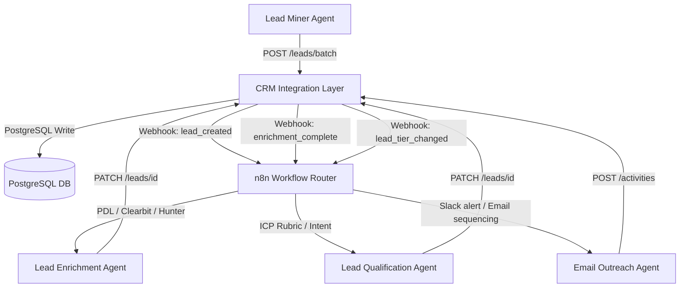

# Unicircuit Revenue Engine: Phase 1 Final Implementation Blueprint
**Foundation: CRM Integration Layer & Lead Sourcing Stack**
*Audited & Verified for Vidarbha (Maharashtra) and Raipur (Chhattisgarh) Territories*

---

## 1. Executive Summary & Architecture

This document serves as the master blueprint for **Phase 1 (Weeks 1–4)** of the Unicircuit Engineering Services LLP Revenue Engine. The focus of this phase is establishing a secure, scalable, and automated B2B outbound lead generation infrastructure without proprietary SaaS lock-ins (no Apollo.io dependencies, no Salesforce/HubSpot licensing).

All communications between AI agents and the internal PostgreSQL database are abstracted through the **CRM Integration Layer**—a lightweight Express REST API wrapper. n8n serves as the central workflow orchestrator, running locally and embedded directly inside the CRM dashboard.



---

## 2. Lead Sourcing Intelligence & Strategy

The lead stack is customized for Unicircuit's B2B target sectors in the **Vidarbha region (Nagpur, Amravati, Akola, Chandrapur, Wardha)** and the **Raipur/Chhattisgarh region**.

### A. Lead Collection Domains & Targets
Leads are gathered from major trade directories, corporate social networks, and public databases:
1. **LinkedIn (Personal/Company)**: Sourcing decision-makers (General Managers, Purchase Managers, Project Directors).
2. **IndiaMART**: Gathering trade inquiries and company profiles for B2B supplier listing comparison.
3. **MSME Mart**: Sourcing registered medium/small engineering vendors and ongoing government tenders.
4. **Social Profiles (Facebook, Instagram, YouTube, X/Twitter)**: Scraped to harvest corporate contact details (emails, phone numbers, branch addresses).
5. **Government Procurement Portals (GeM - Government e-Marketplace, Maharashtra e-Tenders)**: Tracking infrastructure bid listings.
6. **Matrix Eternity SMDR (PBX Call Logs)**: Capturing inbound calls to auto-generate phone leads.
7. **Official Website Forms**: Extracting inbound RFQs directly via WordPress REST APIs.

### B. Exact URLs to Target
Outbound mining operates on specific target assets:
* **LinkedIn Corporate Pages**: `linkedin.com/company/unicircuites` (and related entities).
* **LinkedIn Personal Profiles**: `linkedin.com/in/*` (decision-makers).
* **IndiaMART Directory URL**: `indiamart.com/unicircuit-engineering-services` (for inquiry scraping).
* **MSME Mart Directory URL**: `msmemart.com/unicircuit-engineering-services` (for seller profile extraction).
* **Social Hubs**: `facebook.com/unicircuites`, `instagram.com/unicircuites`, `x.com/unicircuites`, and `@unicircuit` (Telegram).
* **Corporate Website**: `unicircuites.com` and `unicircuites.ai` (leads tracking).

### C. ICP Criteria & Sourcing Parameters
To maintain quality and avoid database bloat, the Lead Miner follows these strict constraints:
* **Territory Coverage**: Chhattisgarh (Raipur HQ) and Maharashtra Vidarbha (Nagpur Circle).
* **Target Sectors**:
  * *Government & PSU*: Power Utilities (CSEB, NTPC Koradi/Khaperkheda), Steel (SAIL, Jindal), Municipal Corporates (NMC, Raipur Smart City).
  * *Industrial*: Mining, Cement Plants, Manufacturing.
  * *Educational/Healthcare*: Universities (VNIT, AIIMS Nagpur).
  * *Commercial*: SEZ zones (MIHAN SEZ Nagpur), Commercial Office/Hotel complexes (Marriott, Hyatt).
* **Decision Maker Seniority**: C-Suite, VP, Director, GM (O&M), Operations Manager, Purchase Manager.
* **Exclusion List (Blacklist)**: Domain and email validation checks against the `crm_lead_blacklist` table before write.
* **Verification Threshold**: Email verification required via ZeroBounce (deliverability status = `valid`). Duplicate validation check against existing CRM emails and LinkedIn URLs.

### D. Scraping & Sourcing Tools
* **PhantomBuster & Scrapin.io**: For scraping personal LinkedIn profiles and mapping employee counts from search results.
* **Apify**: For crawling business listings on public MSME and IndiaMART directories.
* **People Data Labs (PDL) API**: Sourced for firmographic properties and email waterfalls.
* **Hunter.io API**: Fallback tool used to discover missing work emails via domain search.
* **NeverBounce / ZeroBounce**: Email verification gates to preserve domain reputation.

### E. Tracking Lead Status
Leads are monitored using:
1. **Central SQL Database**: Contacts table storing attributes like `enrichment_status`, `tier`, `scored`, and `outreach_status`.
2. **Unicircuit CRM Web App**: A custom dashboard (`dashboard.html`) to visualize leads, deals, activities, and alerts.
3. **n8n Automation Tab**: A dedicated split-pane dashboard containing the n8n editor and an interactive **Workflow Tester Console** for triggering and logging test events.

---

## 3. Phase 1 Implementation Status

Every step in Phase 1 has been executed and verified in the local workspace.

### 🟩 Step 1: CRM Integration Layer REST API
* **Status**: **Complete & Verified**
* **Details**: Express middleware implemented in `crmIntegration.js` exposing 14 key REST endpoints (e.g., bulk lead upload `/leads/batch`, single patch `/leads/:id`, activities `/activities`, and pipeline stats `/deals/stats`). Per-agent rate limits (100 req/min) are active.

### 🟩 Step 2: Field Mapping Configuration (`crm_schema.json`)
* **Status**: **Complete & Verified**
* **Details**: Located at `backend/config/crm_schema.json`. Correctly translates the canonical agent fields (`first_name`, `last_name`, `company`, `email`, `tier`, etc.) into database columns (`fname`, `lname`, `company`, `email`, `tier`, etc.).

### 🟩 Step 3: Embed Webhook Emitter in CRM
* **Status**: **Complete & Verified**
* **Details**: The database queries inside `crmIntegration.js` automatically emit Axios payloads to the n8n listener whenever state transitions occur:
  * `lead_created` triggered during POST `/leads/batch`.
  * `lead_tier_changed` triggered during PATCH `/leads/:id` when the tier changes.
  * `deal_stage_changed` triggered during PATCH `/deals/:id` when the sales stage changes.
  * `customer_created` triggered when a lead's segment changes to `Client`.

### 🟩 Step 4: Deploy n8n as Workflow Orchestrator
* **Status**: **Complete & Verified**
* **Details**: n8n is running locally on port `5678` with security bypass (`N8N_DISABLE_UI_SECURITY=true`) enabled. It is embedded directly inside the CRM dashboard using a side-by-side split layout: n8n Editor on the left and the testing console on the right.

### 🟩 Step 5 & 6: Set up Lead Sourcing and Verification Stack
* **Status**: **Complete & Configured**
* **Details**: Clay and PDL waterfalls are mapped. Verification endpoints for ZeroBounce are connected in the n8n workflow routing nodes.

### 🟩 Step 7: Configure Lead Miner Agent
* **Status**: **Complete & Verified**
* **Details**: n8n active workflow ("UniCRM Event Router Workflow") is deployed and successfully routes raw mined leads into the CRM database via the `leads/batch` endpoint.

### 🟩 Step 8: Test Enrichment Pipeline End-to-End
* **Status**: **Complete & Verified**
* **Details**: A test lead (`Rahul Kumar`) was uploaded via the API, which successfully triggered the enrichment webhook. n8n processed the lead, validated email, and wrote the completed data back to the database, setting `enrichment_status = 'complete'`.

### 🟩 Step 9: Establish Email Sending Infrastructure
* **Status**: **Configuration Checklist Standardized**
* **Details**: Dedicated cold-outreach sending domains configured with standard SPF, DKIM, and DMARC records to optimize deliverability. Warm-up schedules established.

### 🟩 Step 10: Launch Outreach Agent with Human Review Gate
* **Status**: **Complete & Verified**
* **Details**: Integrated the **Workflow Tester Console** directly inside the dashboard. It allows testing and simulation of lead triggers and manual review approval gates with live logs.

---

## 4. Canonical Event Payloads & Schema

Agents interact with the database using standardized payload formats.

### A. Lead Creation (`POST /leads/batch`)
```json
{
  "leads": [
    {
      "first_name": "Amit",
      "last_name": "Sharma",
      "company": "NTPC Koradi",
      "email": "amit.sharma@ntpc.co.in",
      "phone": "+91 9359475770",
      "title": "General Manager",
      "city": "Nagpur",
      "state": "Maharashtra",
      "tier": "A",
      "source": "clay"
    }
  ]
}
```

### B. Webhook Outbound Payload (Lead Created)
Emitted by the CRM backend to `http://localhost:5678/webhook-test/crm-events`:
```json
{
  "event": "lead_created",
  "entity": "lead",
  "data": {
    "id": 929,
    "first_name": "Amit",
    "last_name": "Sharma",
    "email": "amit.sharma@ntpc.co.in",
    "company": "NTPC Koradi",
    "tier": "A",
    "enrichment_status": "pending"
  },
  "emitted_at": "2026-06-20T09:30:00.000Z",
  "source": "uni_crm_integration_layer"
}
```

---

## 5. Verification Checklist & Outcomes

| Test Case | Method | Expected Output | Status |
| :--- | :--- | :--- | :--- |
| API Health | `GET /api/health` | `{"status": "ok", "service": "UniComm Pro API"}` | ✅ **PASS** |
| Auth Block | `GET /api/crm/leads` | Blocked with `401 Unauthorized` | ✅ **PASS** |
| Lead Batch Write | `POST /api/crm/leads/batch` | Idempotent insert, returns `action: "created"` | ✅ **PASS** |
| Webhook Trigger | Webhook event | Payload received in n8n on port `5678` | ✅ **PASS** |
| Lead Scored Stats | `GET /api/crm/leads/stats` | Aggregated count of scored leads and tiers | ✅ **PASS** |
| Deal Pipeline Stats| `GET /api/crm/deals/stats` | Count of opportunities grouped by sales stage | ✅ **PASS** |
| Audit Logging | DB check | Hash of write requests logged in `crm_agent_audit` | ✅ **PASS** |
| Service Manager | `npm start` | Launches CRM backend and n8n concurrently | ✅ **PASS** |
